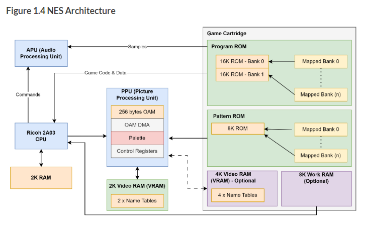
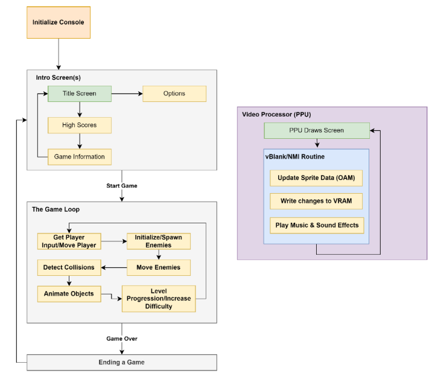

# Context

# NES Architecture

- varient of the 6502 processor (**Ricoh 2A03 CPU** with **2K RAM**)
- **custom Picture Processing Unit (PPU)**
    - **2K Video RAM** that can **optionally be added to with RAM from Game Cartridge**
- **custom Audio Processing Unit (APU)**
    - programmed via commands from CPU
- **game catridge** interface has direct access to CPU/internal memory
    - contains program and data space (fixed/bank)
    - 32K available at one time
- no built-in operating system

# 6502 Assembler

The *NES* console uses a slightly modified version of the popular *8-bit 6502* microprocessor.

# Game Structure

## Initalization
1. Await NES components to be ready
2. Clear memory
3. Initalize sound hardware
    1. Ensure existing sounds are off
4. Detect connected game controllers
5. Display graphics depending on store in ROM
    1. Transfer may be required to PPU.

## Intro Screen(s)
> Title, enemies, high scores

- Title image
    - more info
    - demo-screen
- Settings
    - or separate option screen

### Graphics
NES uses a matrix made up of fixed 8x8 pixel tile **patterns** (background objects). The patterns are loaded from the ROM into the video memory before usage. Cartridge addons can allow individual control per-pixel.

**Sprites** are smaller obects that appear infront/behind background tiles. Sprites are also defined by 8x8 pixel patterns and the patterns for these also are loaded similarly from ROM into video memory before usage.

### Intro Screen Loop

A simple logic loop awaiting user input.

## Core Game Loop
> Drives all logic for the game.

- get player input/move player
    1. initialize/spawn enemies
    2. move enemies
    3. detect collisions
    4. animate all objects
- level progression/increase difficulty

## Graphics Draw
PPU handles the drawing of contents on the screen multiple times per second. The graphics is taken from VRAM. Changes to VRAM can only be sent from ROM or RAM to PPU via control ports. VRAM can only be changed when PPU is not drawing. The `vBlank Interrupt` is sent when drawing is complete.