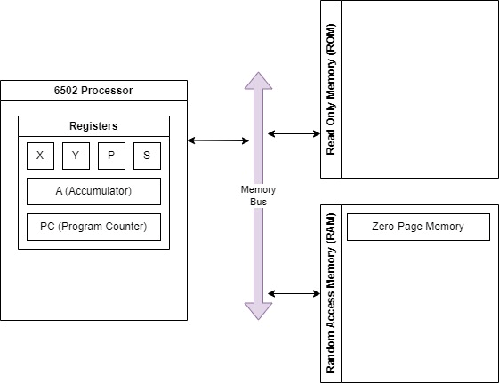

# The Assembler
# Memory & Registers

- CPU moves data between locations
- 8 `1/0` bits create an 8-bit byte allowing numbers 0 - 255
    - `NES` has `2048K` Bytes of RAM.

Architecture:
- Registers - Internal Memory Locations for calculations. Results stored elsewhere.
- Read Only Memory (ROM) - Provided in the game cartridge:
    - `src` code
    - graphical patterns
- Random Access Memory (RAM) - Console memory read/write. More time needed to access.
- Zero Page Memory (ZPM) - First 256 Bytes of RAM for faster access. Still not as fast as register.



## Numerical Representations

- Binary - `%01010101` --> 85
- Hexadecimal - `$55` --> 85
- Decimal - `85` --> 85

## Registers

Limited registers in our CPU mean that we need to devote a lot of code to transfering information between registers and main memory.

- `A` 8 bits - **Accumulator** for arithmetic operations and accessing memory.
- `X` 8 bits - Index in addressing modes.
- `Y` 8 bits - Index in addressing modes.
- `PC` 16 bits - Points to next instruction to be executed (**Program Counter**).
- `S` 8 bits - The **Stack Index** indicating where the next element will be written to the stack.
- `P` 8 bits - The **Status Flag**, containing the current state of the CPU as well as previous results.

## Status Flags

- 7 bit `N` - **Negative**: For negative values.
- 6 bit `V` - **Overflow**: For positive values.
- 5 bit `-` - **Unused**: Always set.
- 4 bit `B` - **Break**: If an interrupt request is triggered by BRK instruction.
- 3 bit `D` - **Decimal**: No effect for NES.
- 2 bit `I` - **Interrupt Disable**: When set interrupt requests are disabled.
- 1 bit `Z` - **Zero**: Equals to values.
- 0 bit `C` - **Carry**: For math and rotate operations.

## Stack
> last-in-first-out structure

Memory from `$0100` to `$01FF` is dedicated to the stack. The stack can be used to store values.

# Data
- memory -> register (loading data)
- register -> memory (storing data)

## Loading
```asm
ld<target register> <source>
```

- `<target register>`: This is the register the source information will end up stored in and can be one of A, X, or Y, so the instruction would either be LDA, LDX or LDY.
- `<source>`: This is where the information comes from.

Available addressing modes for source include:

- Immediate - The actual numerical value is specified immediately after the statement:
```asm
lda #$05
ldx #$05
ldy #$05
```

- Zero-Page Memory - The value is obtained from a location in Zero-Page memory using an 8-bit offset:
```asm
lda #$10
sta $05
 
lda $05
ldx $05
ldy $05
```

- Absolute Memory - The value is obtained from anywhere in memory using a 16-bit memory address:
```asm
lda #$20
sta $0300
 
lda $0300
ldx $0300
ldy $0300
```

- Zero-Page Index with X or Y - The value is obtained from a location in Zero-Page memory by adding an 8-bit offset address to the value in either the X or Y index registers to get the final 8-bit offset:
```asm
lda #$20 	// A = #$20
sta $03		// store value at A at memory address $03; $03 = #$20
 
ldx #$02	// B = #$02
lda $01,X	// $01 + X = $01 + $02 = $03 -> loads value stored at memory $03 which is #$20
```

- Absolute Memory Indexed with X or Y - The value is obtained from a location anywhere in memory starting at specified 16-bit memory address and adding the value in either the X or Y index to determine the final memory address to get the value from:
```asm
// same as last time but any address
lda #$20
sta $0302
 
ldx #$02
lda $0300,X
```

- Zero-Page Indirect Indexed with Y - The value is obtained from a location anywhere in memory starting at the base address stored in the specified two bytes of Zero-Page memory and then the value in the Y register is added to that address to get the final address:
```asm
LDA (<zero-page address>),Y

lda #$EE
sta $0306
 
lda #$00
sta $05
lda #$03
sta $06
 
ldy #$06
lda ($05),Y
```

- Zero-Page Indexed Indirect with X - The value is obtained from a location anywhere in memory starting at the base Zero-Page offset, adding the value in the X register, to get the location in Zero-Page memory where the final address is specified in two bytes of memory.
```asm
LDA (<zero-page address>, X)

lda #$ee
sta $0300
 
lda #$00
sta $05
lda #$03
sta $06
 
ldx #$03
lda ($02,X)
```

## Storing
