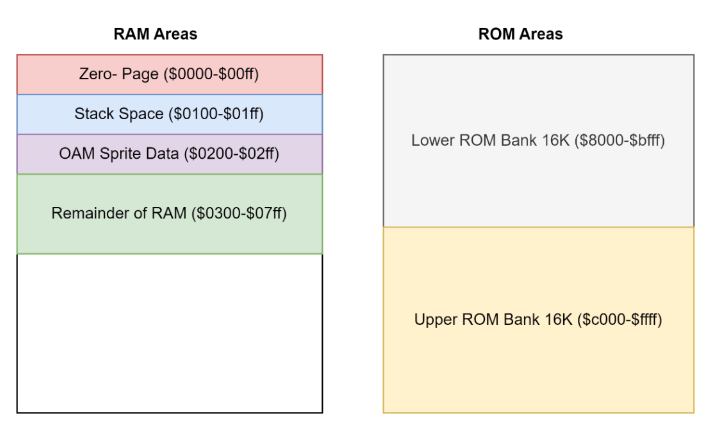

# Template
> This document is referencing the demo game implementation located under the `~/template` directory.

# NES Cartridge Code Structure

Games cartridges contain ROM (memory that does not go away when power is off). The NES can load game software from this. The ROM (cartridge) or RAM (NES) contains game code, although RAM cannot save on power off. Certain configurations must be imported to validate code, thus the following is required for NES:

`.segment <name of segment>`

# NES Memory Configuration

- two continuous banks of ROM:
    - `$8000` - `$FFFF` = 2 x 16k = 32k ROM Space

The configuration file is split into MEMORY and SEGMENTS.

## Memory
> Define 6 areas of NES memory space.

An example:


```cfg
MEMORY {
    ZP:     start = $00,    size = $0100, type = rw, file = "";
    OAM:    start = $0200,  size = $0100, type = rw, file = "";
    RAM:    start = $0300,  size = $0500, type = rw, file = "";
    HDR:    start = $0000,  size = $0010, type = ro, file = %O, fill = yes, fillval = $00;
    PRG:    start = $8000,  size = $8000, type = ro, file = %O, fill = yes, fillval = $00;
    CHR:    start = $0000,  size = $2000, type = ro, file = %O, fill = yes, fillval = $00;
}
```

| Section | Description | Type | Size (Bytes) |
|---|---|---|---|
| ZP | This is the special section of RAM that the 6502 CPU uses as Zero-Page memory. | Read/Write | 256 |
| OAM | This is the special section of RAM set aside for the local copy of the sprite definition table (OAM). This table contains the position, shape, and attributes of each of the sprites displayed on the screen. | Read/Write | 256 |
| RAM | This is the remainder of the 2K of RAM where we can store more variables and set aside space for object tables. We might use this space to keep track of our enemies in our game, or larger blocks of space for tracking changes to the background layout. | Read/Write | 1280 |
| HDR | This is a special section of our ROM that is used to indicate to NES console emulators that the cartridge is a NES cartridge and allows some details of how what features the cartridge uses. It is added as a header on the NES ROM file. | Read Only | 16 |
| PRG | This is our main ROM area where the code and data for our program are stored. For now, we will only have 2 x 16k = 32k of ROM which will be more than enough for our purposes, but later in the book, we will look at how you can have much larger cartridges. | Read Only | 32k |
| CHR | This area of our ROM contains the patterns for our tiles and sprites. In a NES cartridge, depending on the cartridge type, we can have multiple of these pattern tables or even in some cases none. The advantage of having set pattern (CHR) tables is we don’t have to copy them into the graphic processor’s video memory, we can simply specify which section to use, and the NES console will do the rest. The disadvantage of this approach is that the pattern tables, especially when you need a few different sets, take up a lot of room. By taking over this process you can use compression to store even more data. The memory in this area is not directly accessible by the 6502 CPU, only the PPU can access it. | Read Only | 8k |

## Segments
> Map labels in code to locations in memory defined in previous section.

Example configuration:
```cfg
SEGMENTS {
    ZEROPAGE: load = ZP,  type = zp;
    OAM:      load = OAM, type = bss, align = $100;
    BSS:      load = RAM, type = bss;
    HEADER:   load = HDR, type = ro;
    CODE:     load = PRG, type = ro,  start = $8000;
    RODATA:   load = PRG, type = ro;
    VECTORS:  load = PRG, type = ro,  start = $FFFA;
    TILES:    load = CHR, type = ro;
}
```

- `bss` - RAM
- `ro` - Read Only
- `zp` - Zero-Page
- `start` - specifies start location of segment

# NES Defined Values
> Repeated system values can be defined once and allocated a label.

NES system values that provide access to the PPU (graphics), APU (audio) and player controllers.

# NES Header
> Must always be included.

- which mapper is used
    - banks of ROM available
    - banks of CHR available
    - direction name tables are mirrored
- presence of *battery-backed static RAM* (allows saving)

Usually, only the first three lines are altered:
- `INES_MAPPER` - Mapper Type (see further docs)
- `INES_MIRROR` - Horizontally (0) & Vertically (1) mirrored name tables
- `INES_SRAM` - Set to (1) if contains battery backed RAM at $6000-$7fff.

# NES Vectors
> Must always be included.

Defines where the three key interrupts or starting point vectors are. The interrupt stops the CPU from doing whatever it is working on as it receives an external signal instructing it to do so.

- `NMI` - **Non-Maskable Interrupt Handler**: Called when screen is drawn and raster is moving to top of screen.
- `IRQ` - Indicating clock-tick has occurred but incompatible with NES, however can be used with the `BRK` instruction, thus can be used as single subroutine, called with single byte instruction.
- `RESET` - Starting point of title (reset point).

Considering our config file, this segment of code is placed in the ROM at addresses `$FFFA` to `$FFFF`.